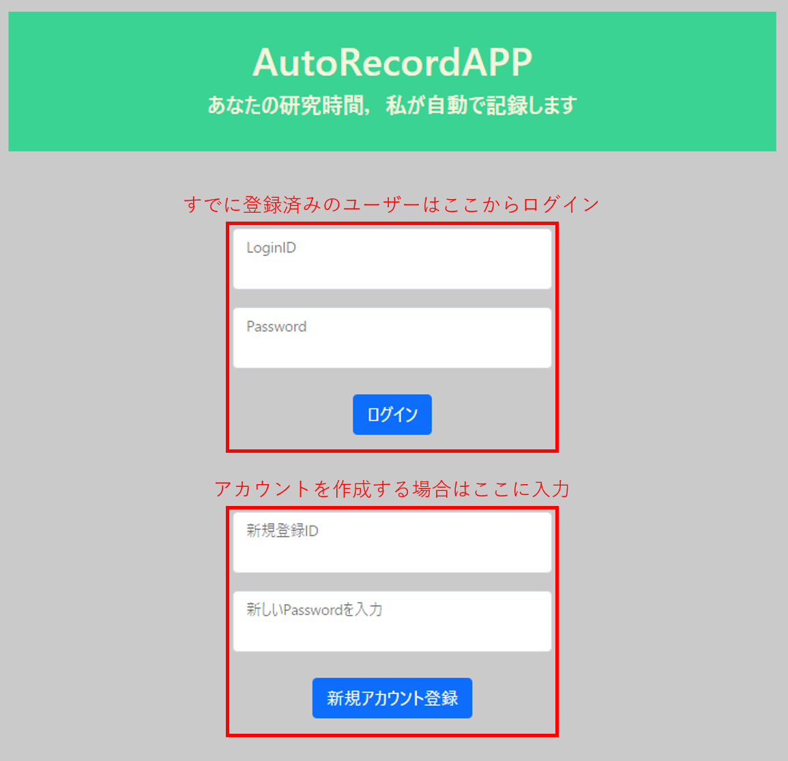
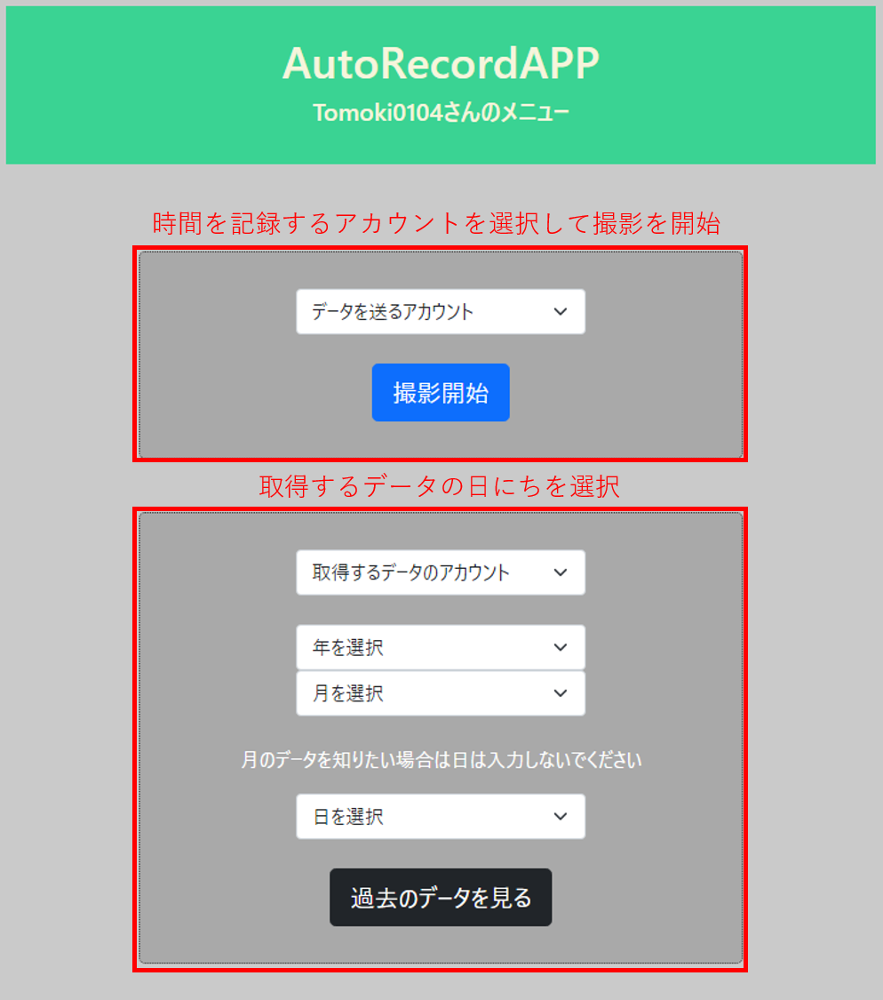
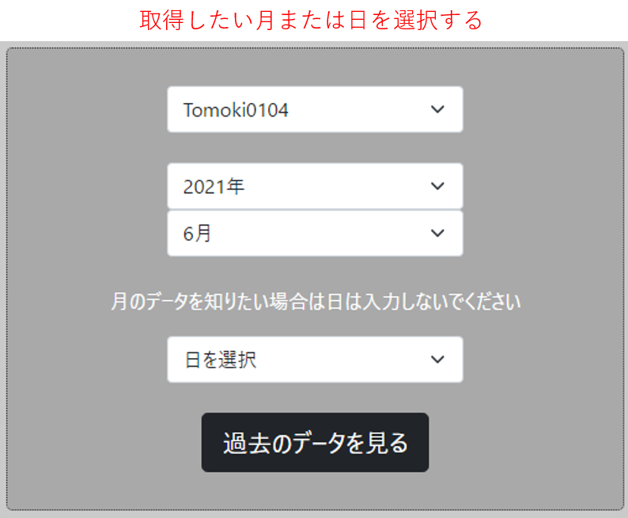
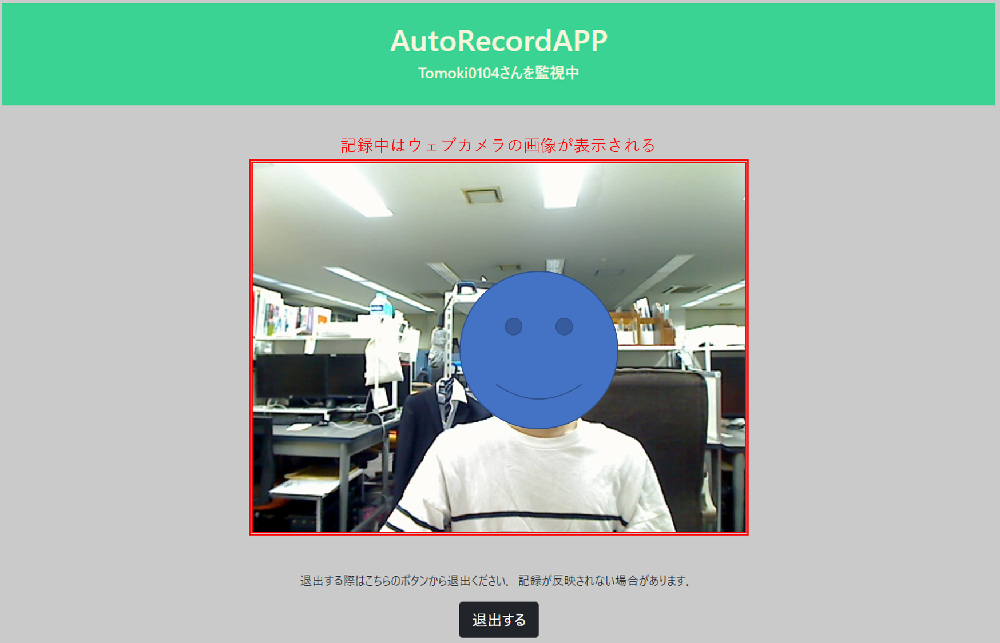

# 時間記録Webアプリケーション

## thanks


[](https://thankyouoss.herokuapp.com/thank/Tomoch0104/TimeRecordApp.svg)

大学で研究・勉強時間記録が義務化されたため，毎日の勉強時間管理を自動で行うWebアプリケーションを開発した．

Github URL：https://github.com/Tomoch0104/TimeRecordApp

## 注意
<h3>
セキュリティの問題上，各個人でFaceApi，Firestoreのキーやjsonファイルを用意してください．
</h3>
<br>

## AzureのFaceApiを設定
以下のサイトから顔検出API用のプロダクトキーとエンドポイントを取得．<br>
https://docs.microsoft.com/ja-jp/azure/cognitive-services/face/quickstarts/client-libraries?tabs=visual-studio&pivots=programming-language-csharp

取得したキーとエンドポイントをfaceDetection.pyの以下に入れる

```python
# faceDetecion.py

# 認証KEYとENDPOINT
KEY = "自分のKEYを入力してください"
ENDPOINT = "自分のENDPOINTを入力してください"

```

## FirebaseのFiretoreを設定
以下のにてプロジェクトを作成し，jsonファイルパスを入手してください<br>
https://console.firebase.google.com/u/0/project/_/database

ご自身のデータベースを作成し，jsonファイルパスを以下に入れる
```python
# firestore.py

# firestoreを初期化する(アプリケーションのデフォルトの認証情報を使用)
cred = credentials.Certificate("ご自身のjsonファイルをご使用ください")
```

## フォルダ構成
> camera.py<br>
> 　　Webカメラで撮影された画像を取得する <br>
> faceApi.py<br>
> 　　取得した画像から顔検出を行い，顔領域を四角で囲む<br>
> faceDetection.py<br>
> 　　AzureFiceAPIテストコード<br>
> firestore.py<br>
> 　　Firestoreにユーザー，日付ごとのデータを保存する<br>
> log.py<br>
> 　　Firestoreのデータから指定された月の勉強時間グラフを作成<br>
> maketable.py<br>
> 　　Firestoreのデータから日ごとの勉強時間の表を作成する<br>
> preview.py<br>
> 　　メイン関数，時間の取得や各htmlファイルの呼び出しを行う<br>
> test.py<br>
> times.py<br>
> 　　時間単位の変更を行う<br>
> templates<br>
> > base.html<br>
> > index_erroinput.html<br>
> > index_errornew.html<br>
> > log.html<br>
> > menu.html<br>
> > preview.html<br>
> > fig


## アプリの様子

<br>

|**ログイン画面**|**メニュー**|
|:---:|:---:|
|||


|**データ取得**|**記録様子**|
|:---:|:---:|
|||
